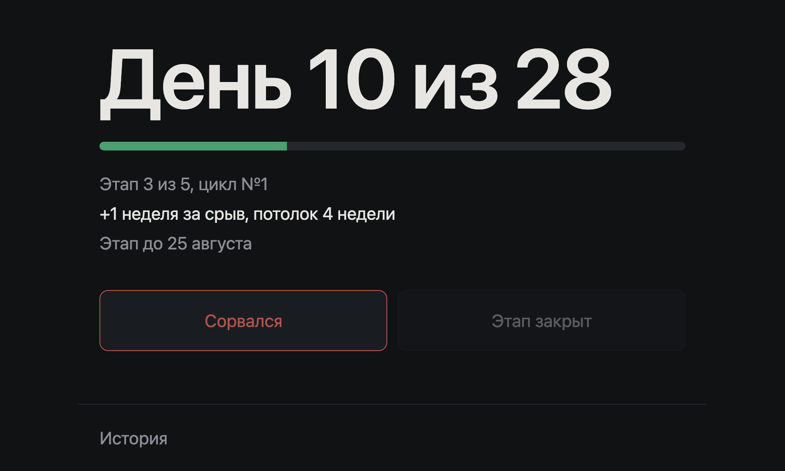
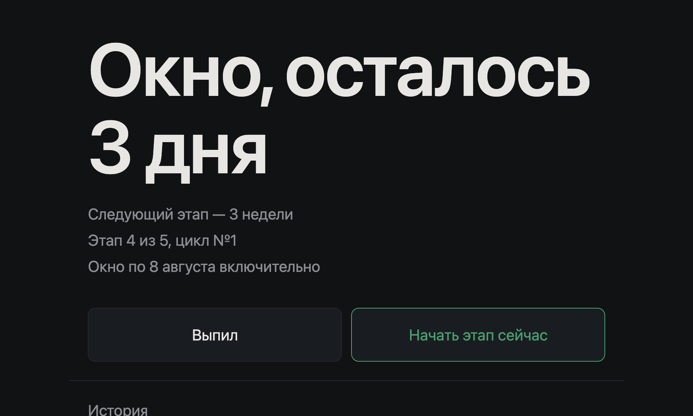
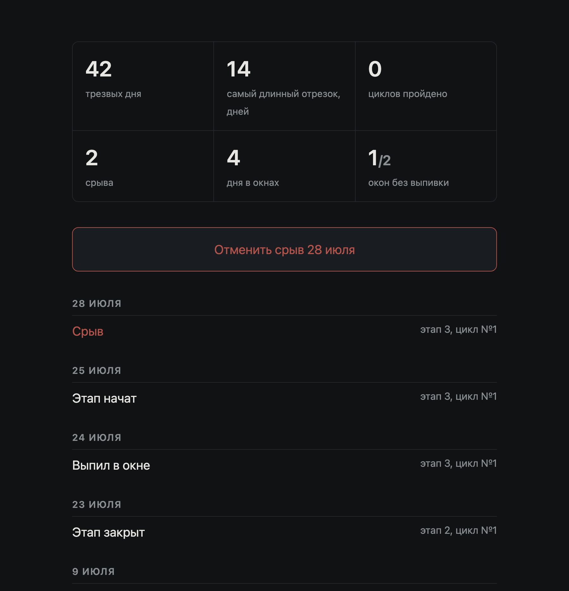

# alcodry

Не пить неделю. Получилось — не пить две. Потом три, ещё три и четыре. Сорвался —
этап начинается сначала и становится на неделю длиннее.

Вот и весь трекер. Держишь вкладку открытой, мельком смотришь на крупное
«День 9 из 14». Нажать надо два раза за этап: когда он дошёл до конца и когда не
дошёл.

Мотивационных цитат, оценок и «ты молодец» здесь нет. Приложение считает дни,
и на этом его работа заканчивается.

<table>
<tr>
<td width="50%"></td>
<td width="50%"></td>
</tr>
<tr>
<td align="center"><em>Идёт этап</em></td>
<td align="center"><em>Наградное окно</em></td>
</tr>
</table>



<sup>На скриншотах демо-данные.</sup>

## Как считается

**Этап** — сколько нужно продержаться. Лестница из пяти: неделя, две, три, ещё
три и четыре. Пройти всё начисто — ровно 13 недель, три месяца.

**Срыв** — это любое количество, хоть одна рюмка. Никаких «ну это же не считается».
Срыв удлиняет текущий этап на неделю и обнуляет отсчёт, но **номер этапа не
двигает**: до конца лестницы приближают только честно закрытые этапы, а не
прошедшее время.

**Потолок.** Длина этапа — `min(база + штраф, самая длинная ступень лестницы)`.
Для лестницы `[1, 2, 3, 3, 4]` это 4 недели: на последнем этапе срыв длину уже
не меняет.

| этап | база | +1 срыв | +2 срыва | +3 срыва |
|---|---|---|---|---|
| 1-й | 1 | 2 | 3 | 4 |
| 2-й | 2 | 3 | 4 | 4 |
| 3-й | 3 | 4 | 4 | 4 |
| 4-й | 3 | 4 | 4 | 4 |
| 5-й | 4 | 4 | 4 | 4 |

**Окно** — три дня после закрытого этапа, когда можно и это не срыв. Кнопка
«Выпил» тут ничего не ломает, просто отмечает для истории. Не хочешь ждать все
три дня — жми «Начать этап сейчас»; забыл про окно — оно закончится само.

**Закрыть этап пораньше не выйдет.** Проверка на сервере, а не только в кнопке:
`POST /api/stage-done` раньше срока отвечает 409 и объясняет, сколько осталось.

## Запуск

```sh
docker compose up -d --build
```

Дальше `http://<адрес-сервера>:7777`. Порт отдаётся в локальную сеть, наружу
приложение не публикуется: ни аутентификации, ни TLS, ни reverse proxy здесь нет
и по замыслу не предполагается.

Всё состояние — один файл `data/tracker.db`, том смонтирован рядом с
`docker-compose.yml` и попадает в бэкап хоста. Бэкап на горячую:

```sh
sqlite3 data/tracker.db ".backup 'data/tracker-$(date +%F).db'"
```

### Начать отсчёт не с сегодня

При первом старте начало отсчёта пишется сегодняшним числом. Если счёт должен
идти с более ранней даты, засейте базу до первого `up` — сработает только на
пустом журнале:

```sh
docker compose build
docker compose run --rm tracker python -c "
from datetime import date
from app import db
conn = db.connect(db.DB_PATH)
db.init_db(conn, date(2026, 8, 1))     # первый трезвый день
"
docker compose up -d
```

## Лестница настраивается

Длины этапов заданы единственной функцией в [`app/logic.py`](app/logic.py):

```python
def stages_for_cycle(cycle_no: int) -> list[int]:
    return [1, 2, 3, 3, 4]
```

Ни количество этапов, ни их длины больше нигде не зашиты — ни в коде, ни в
шаблонах, ни в тестах. Чтобы со второго цикла лестница стала длиннее, достаточно
вернуть отсюда другой список:

```python
return [1, 2, 3, 3, 4] if cycle_no == 1 else [2, 3, 4, 4, 6]
```

Потолок длины этапа поедет за лестницей сам.

## Как устроено

Три слоя, зависимости идут только вниз:

| файл | ответственность |
|---|---|
| [`app/logic.py`](app/logic.py) | правила переходов и статистика. Ни sqlite, ни HTTP, ни системных часов: текущий день всегда приходит параметром |
| [`app/db.py`](app/db.py) | схема, журнал, строка состояния, отмена. Правил предметной области нет |
| [`app/main.py`](app/main.py) | HTTP: JSON API, серверный рендеринг, `TransitionError → 409` |

**Журнал — источник правды.** Таблица `events` только пополняется, а действия в
`logic` возвращают *список событий, а не новое состояние*. Состояние всегда
получается применением событий к предыдущему, поэтому журнал и таблица `state`
разойтись не могут. `rebuild_state_from_events()` проверяет это в тестах и
пересобирает состояние после каждой отмены.

**Никакого планировщика.** Ничего не тикает и не крутится в фоне: даты
сравниваются в момент чтения состояния. Единственный переход, который происходит
«сам» — выход из окна по истечении срока: при первом же обращении после
`window_ends_on` приложение дописывает событие начала этапа. Дата у него —
`window_ends_on + 1`, а не «сегодня», поэтому журнал получается такой же, как
если бы в приложение заходили каждый день. Открытая вкладка раз в минуту
перечитывает себя через HTMX, так что смена суток доезжает без перезагрузки.

**Отмена не трогает автоматику.** Автоматические события помечены флагом `auto` —
это выход из окна и `cycle_done`, спутник закрытия последнего этапа. Кнопка
отмены ищет последнее *пользовательское* действие и сносит его вместе со всем,
что журнал дописал после него сам. Иначе отмена выглядела бы как кнопка, которая
на глазах ничего не делает.

**Даты — календарные, по Москве.** Никаких сравнений по времени суток,
пограничных случаев в полночь нет.

**Статистика — по восстановленным интервалам**, а не по наличию событий.
Пропущенные дни, когда в приложение не заходили, восстанавливаются как дни
идущего этапа. Трезвый день — день режима «этап», в который не было срыва. Дни
окна считаются отдельной цифрой и обрывают серию: это не непрерывная трезвость,
а разрешённая пауза.

## API

Интерфейс ходит в `/ui/*` и получает готовый HTML. Отдельный слой поверх
приложения — бот, уведомления, что угодно — работает с JSON:

```
GET  /api/status        текущее состояние
POST /api/relapse       отметить срыв
POST /api/stage-done    закрыть этап (409, если срок не вышел)
POST /api/window-end    начать этап, не дожидаясь конца окна
POST /api/window-drink  отметить выпивку внутри окна
POST /api/undo          отменить последнее действие
GET  /healthz           проверка живости
```

Все `POST` принимают необязательный `?note=`. Недопустимое действие — 409 с
текстом в поле `detail`, журнал при этом не меняется.

```console
$ curl -s http://localhost:7777/api/status
{"mode":"stage","stage_no":3,"stages_in_cycle":5,"base_weeks":3,"penalty_weeks":1,
 "stage_weeks":4,"days_passed":9,"days_total":28,"days_left":19,"can_close":false,
 "cycle_no":1,"start_date":"2026-07-28","end_date":"2026-08-25"}

$ curl -s -X POST http://localhost:7777/api/stage-done
{"detail":"Этап идёт до 25 августа, осталось 19 дней"}
```

## Клиент для macOS

В [`mac/`](mac/) лежит приложение для строки меню: показывает **2/14** рядом с
иконкой, по клику — «Сорвался» и «Этап закрыт». Своей базы у него нет, ходит в
тот же `/api/status`, так что вкладку держать открытой необязательно.

```sh
./mac/build.sh          # → mac/build/alcodry.app и alcodry.dmg
```

Один файл на Swift, ни Xcode, ни зависимостей. Подробности — в
[mac/README.md](mac/README.md).

## Разработка

```sh
python3 -m venv .venv
.venv/bin/pip install -r requirements.txt
.venv/bin/python -m pytest -q
.venv/bin/python -m uvicorn app.main:app --reload
```

Тесты проверяют логику переходов без HTTP: потолок штрафа, незавершение цикла по
календарю, автовыход из окна, отмену, совпадение журнала с состоянием на любом
префиксе. Отдельный тест подменяет лестницу на `[1, 2]` и убеждается, что цикл
закрывается после двух этапов — страховка от хардкода.

## Чего здесь нет

Аутентификации, пользователей и ролей. Уведомлений, Telegram, почты,
планировщиков. Графиков и аналитики сверх экрана истории. PostgreSQL, Redis,
Celery. Фронтенд-сборки, npm, SPA. Логики переходов в базе.

Исходящих сетевых запросов приложение не делает вообще: HTMX лежит в
[`app/static/`](app/static/), CDN не используется, данные никуда не уходят.

Стек целиком: Python 3.12, FastAPI, SQLite через `sqlite3` из стандартной
библиотеки, Jinja2, HTMX. Четыре строки в `requirements.txt`.

## Лицензия

[MIT](LICENSE).
